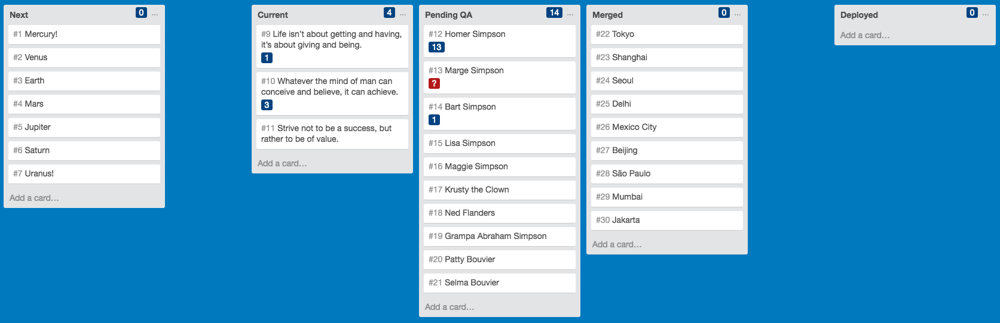

# Mathspacify

## Installation

1.  Download the `mathspacify.crx` file for the latest release:

    https://github.com/mathspace/mathspacify/releases

    > Chrome will warn you that "Apps, extensions, and user scripts cannot be added from this
    > website." That's not a problem, it just means you have to add it yourself in the next step.

2.  Drag-and-drop the `mathspacify.crx` file you downloaded into the Chrome extensions page:

    chrome://extensions/
